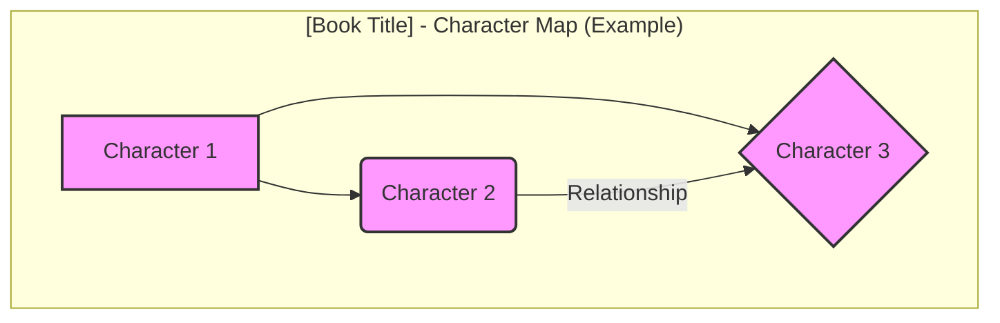
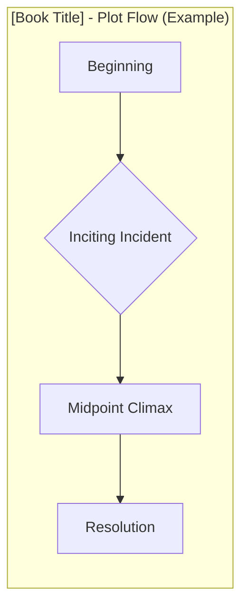

----

---
created: YYYY-MM-DD HH:MM:SS # CHANGE_ME: Update with creation date
author: [Your Name or Organization Name] # CHANGE_ME: Your author credit
version: "1.0"
license(s): CC BY 4.0 # Note: Primarily CC BY 4.0 for diagrams/text, MIT option for potential future code snippets
copyright: Copyright (c) YYYY [Your Name or Organization Name]. All Rights Reserved. # CHANGE_ME: Update year and name

---

# [Book Title] - CyberWorm Visualization
> **Disclaimer:**
>
> This document contains visual interpretations and notes based on the public domain work "[Book Title]", sourced from Project Gutenberg.
> The materials are intended for educational purposes, literary analysis, personal study, and reference.
> As part of the CyberWorm initiative, the content created here (text, diagrams) is licensed under:
> **Creative Commons Attribution 4.0 International License (CC BY 4.0):** Applies to all non-code content, including text, explanations, and Mermaid diagrams/illustrations. Any potential future code snippets related to processing or generation might fall under MIT, but the core visualizations follow CC BY 4.0.
---

## - A Diagrammatic Guide

---
**Source Text:**

*   **Title:** [Book Title]
*   **Author:** [Author Name]
*   **Project Gutenberg Link:** [Direct Link to the ebook on Project Gutenberg] # CHANGE_ME
*   **Note:** The source text is believed to be in the Public Domain in the U.S. Copyright status may vary in other countries.

---

## Overview of Visualizations

This document provides Mermaid diagrams visualizing key aspects of "[Book Title]", including:

*   [List the types of diagrams included, e.g., Character Relationships, Plot Flow, Thematic Connections] # CHANGE_ME
*   ...

These diagrams represent interpretations of the text, designed to aid comprehension and analysis.

---

## Diagram 1: [Specific Diagram Title, e.g., Main Character Relationships] # CHANGE_ME

**Description:** [Briefly explain what this diagram shows and the interpretation choices made.] # CHANGE_ME

*(Replace the above Mermaid code with your actual diagram)* # CHANGE_ME

**Interpretation Notes:**
*   [Add any specific notes about choices made, e.g., line styles representing relationship types, grouping logic, etc.] # CHANGE_ME
*   ...

---

## Diagram 2: [Specific Diagram Title, e.g., Plot Arc Flowchart] # CHANGE_ME

**Description:** [Briefly explain what this diagram shows and the interpretation choices made.] # CHANGE_ME

*(Replace the above Mermaid code with your actual diagram)* # CHANGE_ME

**Interpretation Notes:**
*   [Add any specific notes about choices made, e.g., key turning points selected, level of detail, etc.] # CHANGE_ME
*   ...

---

## (Add More Diagram Sections as Needed)

---

## Further Analysis / Potential Future Diagrams

*   [Note any aspects not yet visualized or ideas for future diagrams related to this book.] # CHANGE_ME
*   ...

---
**Licenses:**

- **MIT License:**   - Full text in [LICENSE](LICENSE) file.
- **Creative Commons Attribution 4.0 International:**  - Legal details in [LICENSE-CC-BY](LICENSE-CC-BY) and at [Creative Commons official site](http://creativecommons.org/licenses/by/4.0/).

---
