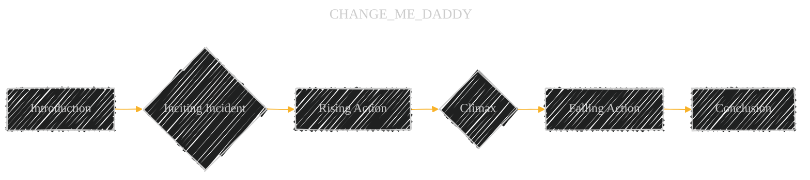

# CyberWorm
Digging Deep into Knowledge, Visualized

[](LICENSE)  [](LICENSE-CC-BY)

---
Copyright (c) 2025 Cong Le. All Rights Reserved.

---

Welcome to the **CyberWorm** initiative! Inspired by the tireless 'bookworm' digging for knowledge, CyberWorm is an overarching project dedicated to transforming complex information from various domains into accessible and insightful Mermaid diagrams. We delve deep into texts, concepts, and systems to unearth their underlying structures and present them visually.

This repository currently hosts **Literature CyberWorm**, our first major branch, focusing on visualizing classic literature from Project Gutenberg.

## Table of Contents

- [About the CyberWorm Initiative](#about-the-cyberworm-initiative)
- [Current Focus: Literature CyberWorm](#current-focus-literature-cyberworm)
- [Vision for Future Expansion](#vision-for-future-expansion)
- [Diagram Types Used](#diagram-types-used)
- [Repository Structure (Literature CyberWorm)](#repository-structure-literature-cyberworm)
- [Getting Started](#getting-started)
- [Usage](#usage)
- [Contributing](#contributing)
- [License](#license)
- [Contact](#contact)
- [Acknowledgments](#acknowledgments)
- [Disclaimer](#disclaimer)
- [Quick Links](#quick-links)
- [Mermaid Resources](#mermaid-resources)

---

## About the CyberWorm Initiative

The digital age offers new ways to understand and interact with information. **CyberWorm** leverages the power of visualization, specifically through Mermaid syntax, to create structured diagrams that illuminate complex subjects. Our core philosophy is to:

- **Dig Deep**: Like a worm exploring the earth, we delve into source materials to understand their core components and relationships.
- **Visualize Structure**: We translate textual or conceptual complexity into clear, logical diagrams (flowcharts, mind maps, sequence diagrams, etc.).
- **Enhance Understanding**: Provide alternative, visual pathways for learning and analysis across different fields.
- **Promote Open Knowledge**: Share these visual interpretations openly, fostering education and exploration.

The **CyberWorm** name reflects this process of digitally "burrowing" into knowledge domains to reveal their intricate structures.

---

## Current Focus: Literature CyberWorm

This repository currently serves as the home for **Literature CyberWorm**. It focuses on:

- **Source Material**: Classic literary works available for free from Project Gutenberg.
- **Goal**: To transform these rich narratives, character interactions, and thematic elements into engaging Mermaid diagrams.
- **Audience**: Students, educators, literature enthusiasts, and anyone seeking a visual approach to understanding classic texts.

We aim to make timeless literature more approachable and analyzable through graphical representations.

---

## Vision for Future Expansion

The CyberWorm framework is designed for extensibility. We envision expanding into other knowledge domains in the future, potentially under distinct sub-brands:

-   **`Math CyberWorm`**: Visualizing mathematical concepts, theorems, and proofs.
-   **`Software Engineering CyberWorm`**: Diagramming algorithms, design patterns, system architectures, and development processes.
-   **`History CyberWorm`**: Mapping historical events, timelines, and causal relationships.
-   **`Science CyberWorm`**: Illustrating scientific concepts, processes, and classifications.
-   *(Other domains as interest and contributions allow)*

Each branch would adapt diagramming techniques best suited to the specific subject matter, all under the unified CyberWorm goal of visual knowledge representation.

---

## Diagram Types Used (in Literature CyberWorm)

For **Literature CyberWorm**, we utilize various Mermaid diagram types, including:

-   **Flowcharts**: Mapping plot progression, character decision paths.





-   **Sequence Diagrams**: Showing character dialogues and interactions chronologically.


-   **Mind Maps**: Representing character traits, relationships, thematic clusters, or setting details.


-   **State Diagrams**: Tracking a character's emotional journey or changing status.


-   **ER Diagrams**: Modeling relationships between key entities (Characters, Locations, Events).


*(Specific diagrams are chosen based on the best fit for representing a particular aspect of the literary work.)*

---

## Repository Structure (Literature CyberWorm)

This repository, focusing on **Literature CyberWorm**, is organized by book title:

-   **Book Title Folder**: Contains all diagrams for one specific ebook.
-   **README.md (in Book Folder)**: Provides context on the book, the diagrams' intent, interpretation notes, and a link to the Project Gutenberg source. Licensed under [CC BY 4.0](https://creativecommons.org/licenses/by/4.0/).
-   **Mermaid Files (.md)**: Contain the raw Mermaid syntax for diagrams. Licensed under [CC BY 4.0](https://creativecommons.org/licenses/by/4.0/).

```markdown
CyberWorm/ (Or Literature-CyberWorm/ depending on your repo naming)
│
├── README.md  (This file - project overview and license information)
│
├── [Book Title 1]/
│   ├── README.md               (Book context and explanations - CC BY 4.0)
│   ├── Character_Map.md       (Mermaid diagram - CC BY 4.0)
│   └── Plot_Flow.md           (Mermaid diagram - CC BY 4.0)
│
├── [Book Title 2]/
│   ├── README.md               (Book context and explanations - CC BY 4.0)
│   └── Themes_MindMap.md      (Mermaid diagram - CC BY 4.0)
│
├── LICENSE-CC-BY-4.0    (Full text of the Creative Commons BY 4.0 License)
│
└── ... (other book folders)
```

---

## Getting Started

### Prerequisites

-   **Interest in the Subject Matter**: Currently, classic literature.
-   **Web Browser**: For viewing rendered Mermaid diagrams (e.g., on GitHub).
-   **Basic Mermaid Knowledge (Optional)**: Helpful for understanding or contributing.
-   **Git (Optional)**: For cloning or contributing.

### Cloning the Repository

```bash
git clone [Link to Your Repository, e.g., https://github.com/YourUsername/CyberWorm]
```

---

## Usage

### Exploring the Visualizations

1.  **Navigate**: Browse the folders for a book you're interested in.
2.  **View Diagrams**: Open `.mmd` files. GitHub renders them automatically. You can also copy the code into the [Mermaid Live Editor](https://mermaid.live/).
3.  **Read Context**: Check the `README.md` in each book's folder for interpretation notes.
4.  **Learn & Analyze**: Use the diagrams as a tool to supplement your reading and analysis. Adhere to the CC BY 4.0 license if reusing/adapting diagrams.

---

## Contributing

Contributions are welcome to expand the CyberWorm universe! We need help with:

-   Creating diagrams for more Project Gutenberg books (**Literature CyberWorm**).
-   Refining existing diagrams for clarity and accuracy.
-   Exploring diagramming possibilities for future branches (Math, Software Engineering, etc.).
-   Improving documentation and suggesting new visualization approaches.

(Detailed contribution guidelines will be developed. TBD.)

---

## License

1.  **Source Texts**: Ebooks from Project Gutenberg are generally **Public Domain in the U.S.** Copyright status varies elsewhere; verify for your location. See [Project Gutenberg Licensing](https://www.gutenberg.org/policy/license.html).
2.  **CyberWorm Content**: All diagrams (`.mmd`) and explanatory text (`README.md` files) created specifically for the CyberWorm project are licensed under the [Creative Commons Attribution 4.0 International License (CC BY 4.0)](https://creativecommons.org/licenses/by/4.0/). Credit must be given when sharing or adapting.

---

## Contact

Cong Le: conglejobs@gmail.com


---

## Acknowledgments

-   **Project Gutenberg**: For the invaluable service of providing free access to classic literature.
-   **Mermaid JS Community**: For the powerful and accessible diagramming tool.

---

## Disclaimer

The diagrams within CyberWorm represent *interpretations*. They aim to clarify structure but may simplify complex nuances. Always consult the original source material for full context. The "CyberWorm" name signifies a deep digital exploration for knowledge, unrelated to computer malware. Copyright status of source texts from Project Gutenberg should be verified based on your location.

---

## Quick Links

-   [Project Gutenberg](https://www.gutenberg.org/)
-   [Mermaid JS Documentation](https://mermaid.js.org/intro/)
-   [Mermaid Live Editor](https://mermaid.live/)

---

## Mermaid Resources

-   [Mermaid Syntax Reference](https://mermaid.js.org/syntax/flowchart.html)
-   [Basic Mermaid Tutorial](https://mermaid.js.org/intro/syntax-reference.html)


---
