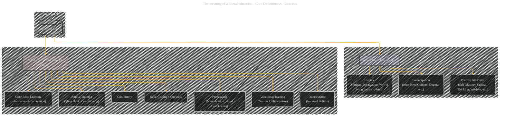
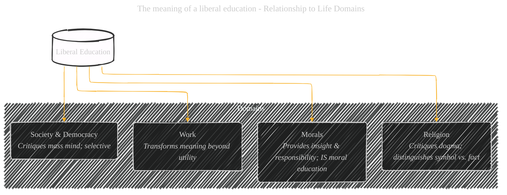
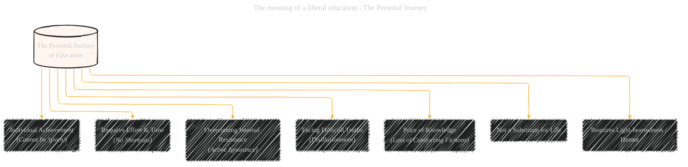

# The meaning of a liberal education - CyberWorm Visualization
> **Disclaimer:**
>
> This document contains visual interpretations and notes based on the public domain work "The meaning of a liberal education", sourced from Project Gutenberg.
> The materials are intended for educational purposes, literary analysis, personal study, and reference.
> As part of the CyberWorm initiative, the content created here (text, diagrams) is licensed under:
>
> **Creative Commons Attribution 4.0 International License (CC BY 4.0):** Applies to all non-code content, including text, explanations, and Mermaid diagrams/illustrations. Any potential future code snippets related to processing or generation might fall under MIT, but the core visualizations follow CC BY 4.0.

-----

**Source Text: https://www.gutenberg.org/cache/epub/75711/pg75711-images.html**

*   **Title:** The meaning of a liberal education
*   **Author:** Everett Dean Martin
*   **Project Gutenberg Link:** https://www.gutenberg.org/ebooks/75711
*   **Note:** The source text is believed to be in the Public Domain in the U.S. Copyright status may vary in other countries.

------

## Overview of Visualizations

This document provides Mermaid diagrams visualizing the main concepts and complexities discussed in the book "The meaning of a liberal education".

**Explanation of Structure:**

1.  **Root:** The central topic of the book.
2.  **Level 1 Branches:** These represent the major thematic sections or overarching concepts discussed throughout the book:
    *   **Definition & Nature:** What the author argues liberal education fundamentally *is*.
    *   **Contrasts:** What the author explicitly argues liberal education *is not*, setting it apart from common substitutes or misconceptions.
    *   **Characteristics:** The key qualities, virtues, or mental habits associated with an educated person.
    *   **Historical Perspectives:** The examination of key figures and movements that illustrate or have shaped the concept of liberal education.
    *   **Relationship to Life Domains:** How liberal education intersects with and potentially transforms major areas of human activity and thought.
    *   **Critiques of Modern Trends:** The author's criticisms of contemporary American society, education systems, and cultural tendencies that hinder genuine liberal education.
    *   **Adult Education:** Specific focus on the potential and problems of extending education into adulthood.
    *   **Personal Journey:** Emphasis on education as an individual's internal process and struggle.
3.  **Level 2+ Branches:** These break down the Level 1 concepts into more specific points, examples, or nuances drawn directly from the text. For instance, under "Contrasts," "Animal Training" is further broken down into the specific aspects criticized (habit formation only, conditioned reflexes, etc.). Under "Historical Perspectives," specific figures (Socrates, Plato, etc.) are listed with their key contributions or relevance as discussed by Martin.

This structure aims to capture the core arguments, distinctions, and historical context presented by Everett Dean Martin in defining and exploring the meaning of a liberal education.

-----

## Diagram 1: Core Definition vs Contrasts (Flowchart)

----

## Diagram 2: Characteristics of the Educated Mind (Mindmap)

----

## Diagram 3: Historical Perspectives (Flowchart LR)

```mermaid
---
title: "The meaning of a liberal education - Historical Perspectives"
author: "Cong Le"
version: "1.0"
license(s): "MIT, CC BY 4.0"
copyright: "Copyright (c) 2025 Cong Le. All Rights Reserved."
config:
  layout: elk
  look: handDrawn
  theme: dark
---
%%%%%%%% Mermaid version v11.4.1-b.14
%%%%%%%% Toggle theme value to `base` to activate the initilization below for the customized theme version.
%%%%%%%% Available curve styles include the following keywords:
%% basis, bumpX, bumpY, cardinal, catmullRom, linear, monotoneX, monotoneY, natural, step, stepAfter, stepBefore.
%%{
  init: {
    'graph': { 'htmlLabels': false, 'curve': 'linear' },
    'fontFamily': 'Fantasy',
    'themeVariables': {
      'primaryColor': '#ffff',
      'primaryTextColor': '#55ff',
      'primaryBorderColor': '#7c2',
      'lineColor': '#F8B229',
      'secondaryColor': '#006100',
      'tertiaryColor': '#fff'
    }
  }
}%%
graph LR
    subgraph Greece["Classical Tradition: Greece"]
        Socrates("Socrates<br/><i>Questioning, Virtue=Wisdom</i>") --> Plato("Plato<br/><i>Idealism, The Good, Republic</i>")
        Plato --> Aristotle("Aristotle<br/><i>Ethics, The Mean, Sanity</i>")
    end

    subgraph Renaissance["Humanism: Renaissance"]
        Erasmus("Erasmus<br/><i>Scholarship, Tolerance, Irony</i>") --> Montaigne("Montaigne<br/><i>Essays, Skepticism, Amateur Spirit</i>")
    end

    subgraph Modernity["Science & Modernity"]
        Huxley("Huxley<br/><i>Science, Evolution, Agnosticism</i>") --> Critiques("Critiques & Evolution<br/><i>Mechanism, Organicism</i>")
    end

    Greece --> Renaissance
    Renaissance --> Modernity

    style Greece fill:#cff3,stroke:#333,stroke-width:1px
    style Renaissance fill:#fcf3,stroke:#333,stroke-width:1px
    style Modernity fill:#ffc3,stroke:#333,stroke-width:1px
```

---

## Diagram 4: Relationship to Life Domains (Flowchart TD)

---

## Diagram 5: Critiques of Modern Trends (Flowchart TD - List Style)

---

## Diagram 6: Adult Education in America (Flowchart TD - Pros/Cons Style)

---

## Diagram 7: The Personal Journey (Flowchart TD)

---
**Licenses:**

- **MIT License:**   - Full text in [LICENSE](LICENSE) file.
- **Creative Commons Attribution 4.0 International:**  - Legal details in [LICENSE-CC-BY](LICENSE-CC-BY) and at [Creative Commons official site](http://creativecommons.org/licenses/by/4.0/).

---
